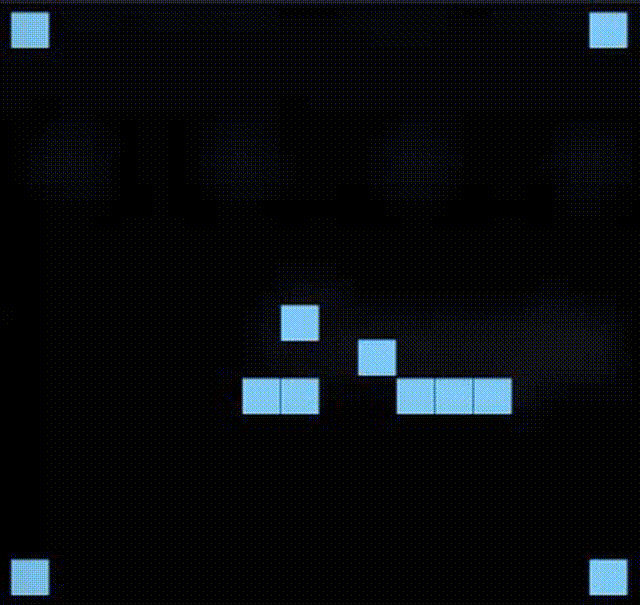

<!-- Improved compatibility of back to top link: See: https://github.com/othneildrew/Best-README-Template/pull/73 -->
<a id="readme-top"></a>
<!--
*** Thanks for checking out the Best-README-Template. If you have a suggestion
*** that would make this better, please fork the repo and create a pull request
*** or simply open an issue with the tag "enhancement".
*** Don't forget to give the project a star!
*** Thanks again! Now go create something AMAZING! :D
-->


<!-- PROJECT SHIELDS -->
<!--
*** I'm using markdown "reference style" links for readability.
*** Reference links are enclosed in brackets [ ] instead of parentheses ( ).
*** See the bottom of this document for the declaration of the reference variables
*** for contributors-url, forks-url, etc. This is an optional, concise syntax you may use.
*** https://www.markdownguide.org/basic-syntax/#reference-style-links
-->
[![Contributors][contributors-shield]][contributors-url]
[![Forks][forks-shield]][forks-url]
[![Issues][issues-shield]][issues-url]


<!-- PROJECT LOGO -->
<br />
<div align="center">
  <a href="https://github.com/grungger/HIVE">
    
  </a>

<h3 align="center">HIVE - Highly Inefficient Virtual Emulator</h3>

  <p align="center">
    CPU built from NAND gates simulated in C++ to run Conways Game of Life
    <br />
    <a href="https://github.com/grungger/HIVE"><strong>Explore the docs »</strong></a>
    &middot;
    <a href="https://github.com/grungger/HIVE/issues/new?labels=bug&template=bug-report---.md">Report Bug</a>
    &middot;
    <a href="https://github.com/grungger/HIVE/issues/new?labels=enhancement&template=feature-request---.md">Request Feature</a>
  </p>
</div>


<!-- ABOUT THE PROJECT -->
## About The Project

The codebase HIVE was developed as an educational project in order to get an intuitive understanding of how CPU's are built from simple logic gates.

The project aimed to build a fully working Turing complete CPU architecture which can run simple programs on it while only using NAND gates to build the CPU. 

The NAND gate is pretty much the only "gate" class that uses C++ logic (if statements) to determine the output of a gate. All other logic gates are then built via combinations of NAND gates or other gates that have already been assembled from NAND gates. This makes it possible to essentially build an entire CPU architecture only from this NAND gate with one exception: to simulate ticks in time and to retain information from one tick to the next I also had to include a delay component which stores one bit of memory and outputs it one tick later. This is enough to build a complete architecture as implemented in Turing_Complete/MagnumOpus.cpp. 

For convenience I added a screen output method that uses escape codes to print to a persistent display as well as a RAM component which stores words in a C++ array (I coud have implemented it using only NAND gates but it would have slowed down the performance too much so it is just a neat addon). This is then the final architecture HIVEarchitecture/lib/HIVEmind.cpp which is a very slow and inefficient virtual emulator of a CPU. 

It can run Conway's Game of Life successfully in a 16x16 square as implemented in HIVEarchitecture/HIVE/GameofLife.cpp - this is the gif at the top of the README which is the captured output sped up 120x (I spared you from the agony of staring at the screen waiting for the next generation to appear).


<!-- GETTING STARTED -->
## Getting Started

If for some reason you want to experience extreme inefficiency the codebase can be built with cmake.  
Simply `cd` to the cloned project directory HIVE add a build folder then `cd` into it and run `cmake ..`. Then the entire project is built by running `make` inside the build folder. If you want to build a specific target check the cmake files in the individual libraries to check for target names. All basic libraries containing all the derived gates have tests written for them and they can be collectively run via `make test`.

### Installation

Just clone the repo
   ```sh
   git clone https://github.com/grungger/HIVE.git
   ```

<!-- USAGE EXAMPLES -->
## Usage

See for example HIVEarchitecture/HIVE/GameofLIfe.cpp for an example on how to use the HIVE CPU and write a program for it.

<!-- CONTRIBUTING -->
## Contributing

I am very open to contributions and extensions to this codebase. Feel free to fork and create a pull request.

Don't forget to give the project a star! Thanks again!


Project Link: [https://github.com/grungger/HIVE](https://github.com/grungger/HIVE)

<p align="right">(<a href="#readme-top">back to top</a>)</p>


<!-- MARKDOWN LINKS & IMAGES -->
<!-- https://www.markdownguide.org/basic-syntax/#reference-style-links -->
[contributors-shield]: https://img.shields.io/github/contributors/grungger/HIVE.svg?style=for-the-badge
[contributors-url]: https://github.com/grungger/HIVE/graphs/contributors
[forks-shield]: https://img.shields.io/github/forks/grungger/HIVE.svg?style=for-the-badge
[forks-url]: https://github.com/grungger/HIVE/network/members
[stars-shield]: https://img.shields.io/github/stars/grungger/HIVE.svg?style=for-the-badge
[stars-url]: https://github.com/grungger/HIVE/stargazers
[issues-shield]: https://img.shields.io/github/issues/grungger/HIVE.svg?style=for-the-badge
[issues-url]: https://github.com/grungger/HIVE/issues
[license-shield]: https://img.shields.io/github/license/grungger/HIVE.svg?style=for-the-badge
[product-screenshot]: images/screenshot.png
<!-- Shields.io badges. You can a comprehensive list with many more badges at: https://github.com/inttter/md-badges -->
[Next.js]: https://img.shields.io/badge/next.js-000000?style=for-the-badge&logo=nextdotjs&logoColor=white
[Next-url]: https://nextjs.org/
[React.js]: https://img.shields.io/badge/React-20232A?style=for-the-badge&logo=react&logoColor=61DAFB
[React-url]: https://reactjs.org/
[Vue.js]: https://img.shields.io/badge/Vue.js-35495E?style=for-the-badge&logo=vuedotjs&logoColor=4FC08D
[Vue-url]: https://vuejs.org/
[Angular.io]: https://img.shields.io/badge/Angular-DD0031?style=for-the-badge&logo=angular&logoColor=white
[Angular-url]: https://angular.io/
[Svelte.dev]: https://img.shields.io/badge/Svelte-4A4A55?style=for-the-badge&logo=svelte&logoColor=FF3E00
[Svelte-url]: https://svelte.dev/
[Laravel.com]: https://img.shields.io/badge/Laravel-FF2D20?style=for-the-badge&logo=laravel&logoColor=white
[Laravel-url]: https://laravel.com
[Bootstrap.com]: https://img.shields.io/badge/Bootstrap-563D7C?style=for-the-badge&logo=bootstrap&logoColor=white
[Bootstrap-url]: https://getbootstrap.com
[JQuery.com]: https://img.shields.io/badge/jQuery-0769AD?style=for-the-badge&logo=jquery&logoColor=white
[JQuery-url]: https://jquery.com 
